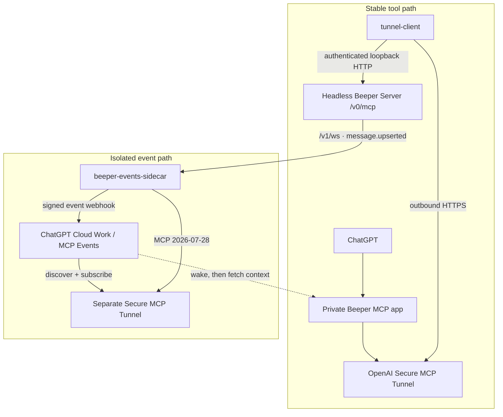

# ChatGPT ↔ Beeper: private MCP tools plus an isolated Events sidecar

A small deployment case study and reference implementation for connecting a headless Beeper Server to ChatGPT without exposing Beeper's MCP listener to the public Internet.

The **stable tool path** uses Beeper's native MCP endpoint unchanged for search, reads, and explicitly authorized sends. A second, deliberately isolated **Events sidecar** adds realtime incoming-message wakeups without proxying or replacing that working MCP server.

> **Reusable pattern:** add MCP Events to an upstream MCP server without modifying or proxying its stable tool API. Keep the original MCP intact and attach a small event-only sidecar to the upstream application's realtime feed.

The original end-to-end tool test searched Beeper, read a conversation, and sent one explicitly authorized WhatsApp message. The Events path was subsequently verified end-to-end with a filtered incoming-message subscription that woke a ChatGPT Cloud Work automation. The event payload contained identifiers and metadata, not message text.

The Windows workstation used during setup is outside both deployed request paths. See [EVENTS-SIDECAR.md](EVENTS-SIDECAR.md) for the sidecar design, reliability model, security boundaries, deployment outline, and test status.

## Architecture



The two paths are separate failure domains. If the sidecar, its state database, its Events tunnel, or the ChatGPT Events surface is unavailable, the native Beeper MCP path remains usable.

The diagram distinguishes logical flow from network initiation. Both tunnel clients initiate outbound connections to OpenAI; neither Beeper nor the sidecar needs a public inbound MCP listener. “Private” describes listener exposure, not end-to-end data locality: tool inputs/results still pass through OpenAI, and messages still use Beeper and their connected messaging network.

## End-to-end Events result

On **7 October 2026**, the isolated Events path was verified against ChatGPT's native automation/event surface:

- the Events source was discovered successfully;
- the sidecar advertised `message.created` with `account_ids`, `chat_ids`, and `sender_ids` filters;
- self-authored test messages were observed by Beeper but correctly suppressed by the sidecar;
- a narrowly filtered inbound test message produced a native MCP event and automatically triggered the subscribed Cloud Work automation;
- the delivered event contained account/chat/message/sender identifiers and timestamps, but **no message text**;
- immediately after delivery the sidecar reported one active subscription, no pending deliveries, no dead-letter deliveries, a connected source, and no source error.

A separate ordinary-Chat experiment confirmed that Chat can use the sidecar's normal `events_status` MCP tool, but the native event-source discovery/subscription controls exposed in Cloud Work were not available in that Chat surface. That is recorded as an observed product-surface limitation, not a claim that the underlying Chat runtime could never support Events.

## Live reliability pass

A live restart/failure-boundary pass on **7 October 2026** also passed:

- restarting the sidecar preserved the active subscription and durable state;
- a test-bot message that arrived while the sidecar was stopped was recovered by
  reconciliation after restart;
- the first overlapping recovery scan inserted one event and the immediate
  repeat scan inserted zero, demonstrating live idempotency on the same source
  window;
- the recovered event had one delivery and received HTTP 200 on its first
  delivery attempt;
- a full VM reboot brought Beeper Server, the stable tunnel, the sidecar, and
  the Events tunnel back automatically; both tunnel readiness endpoints returned
  HTTP 200;
- a transient sidecar-to-Beeper connection error during boot self-healed through
  the reconnect/reconciliation loop;
- deliberately stopping the Events tunnel did **not** break the stable native
  Beeper MCP app; and
- the final sidecar state was source-connected with one active test subscription,
  zero pending deliveries, zero dead-letter deliveries, and no source error.

See [EVENTS-SIDECAR.md](EVENTS-SIDECAR.md#live-reliability-pass) for details and
the remaining ChatGPT product-surface/notification limitations.

## What was verified

Inspection date: **7 October 2026**.

| Component or check | Observed result |
|---|---|
| VM | Ubuntu 24.04.5 LTS, Linux ARM64 |
| Beeper CLI | `0.6.2` |
| Installed Beeper Server build | `nightly-4.3.181-1791315107868` (upgraded from 4.3.178 during the Events feasibility check) |
| MCP-reported server identity | `beeper_desktop_api_api`, protocol-reported server version `4.2.2` |
| Fresh MCP negotiation after the 4.3.181 upgrade | Still `2025-06-18`; native OpenAI MCP Events support was not exposed |
| OpenAI tunnel client | `0.0.15`, commit `a390c168ff1b2d14e73a95991c186c6aba3ff5a0` |
| Beeper listener | Loopback only, port `23374` |
| Native MCP route | `/v0/mcp` |
| Request without Beeper authentication | HTTP `401` |
| Authenticated MCP initialization and discovery | Succeeded; 12 tools returned |
| Tunnel `/healthz` and `/readyz` | Both HTTP `200` |
| Beeper and tunnel user services | Running and enabled |
| User lingering | Enabled |
| VM reboot recovery | Passed after adding the MCP startup wait; readiness observed at 28 seconds after boot |
| Credential files inspected | Owner-only permissions (`0600`) |
| Events source discovery | Succeeded; `message.created` and account/chat/sender filters advertised |
| Self-authored incoming-message suppression | Verified in live test |
| Cloud Work event wake-up | Verified end-to-end with a narrowly filtered inbound test event |
| Event payload minimization | Verified; no message text in delivered payload |
| Sidecar status after live delivery | Source connected; no source error; no pending or dead-letter deliveries |
| Ordinary Chat Events subscription | Normal sidecar MCP tool callable; native subscription controls not exposed in the tested Chat surface |

The original ChatGPT session and operator report establish the successful read/send test. The publication review independently rechecked the running configuration, local MCP initialization, tool discovery, and tunnel health. A subsequent VM reboot test exposed a startup-order failure. After adding the startup wait described below, a second reboot passed, including a connected-account metadata call through the actual custom app. No WhatsApp send was repeated, no private messages were read, and not every advertised tool was tested.

The installed build name and the version returned by MCP initialization are different version surfaces; they should not be presented as interchangeable. Desktop-oriented tools such as `focus_app` being advertised also does not establish that they are useful headlessly.

## What comes from upstream, and what this case adds

| Established upstream behavior | Contribution of this case study |
|---|---|
| OpenAI documents private MCP access through its outbound tunnel client. | A checked deployment against Beeper's authenticated native MCP endpoint on a cloud VM. |
| Beeper's CLI documents headless Server installation and device verification. | Confirmation that this particular Server build exposes working native MCP discovery. |
| Beeper documents bearer authentication for `/v0/mcp`. | A deployed configuration that supplies the header from a protected file. |
| OpenAI documents file/environment references for static MCP headers. | A concrete separation between the OpenAI runtime key and the Beeper access token. |
| The tunnel client provides an optional wait for its MCP listener. | A real reboot failure reproduced without it, then successful automatic recovery after enabling it. |
| Python's Windows password reader has character-level input behavior. | A practical diagnostic for a reported malformed-key setup failure, with an explicit evidence limit. |
| Beeper exposes realtime `message.upserted` events over `/v1/ws`. | An event-only sidecar that turns those signals into durable, filtered MCP Events without replacing Beeper's native MCP tools. |
| OpenAI MCP Events provides event discovery/subscription and signed webhook delivery. | A live-tested composition in which the event path wakes ChatGPT and the stable upstream MCP remains the context/action path. |

References: [Beeper CLI](https://github.com/beeper/cli), [headless setup](https://github.com/beeper/cli/blob/main/packages/cli/docs/setup.md), [Beeper MCP](https://developers.beeper.com/desktop-api/mcp/), [Beeper authentication](https://developers.beeper.com/desktop-api/auth/), and [tunnel configuration at the inspected revision](https://github.com/openai/tunnel-client/blob/a390c168ff1b2d14e73a95991c186c6aba3ff5a0/docs/configuration.md).

## Reproduce the configuration

These steps reconstruct the inspected arrangement with your own account and credentials. They are a reviewed runbook, **not a separately tested clean-room installer**. Commands below create services and credentials on your chosen VM; review them there before running them. Never run them over an existing deployment without checking for conflicts.

### 1. Prepare the VM and prerequisites

Use a supported Linux VM with outbound access for OpenAI, Beeper, and the connected networks. This deployment used Oracle Cloud; the architecture does not depend on an Oracle-specific feature. No claim is made that the complete service, subscriptions, or future hosting will be free.

You need a Beeper account, its connected messaging account, a way to approve Beeper device verification, and access to ChatGPT custom MCP apps and Platform tunnels. Tunnel use and ChatGPT app access have separate permissions. Consult the [OpenAI permission and workspace-association instructions](https://developers.openai.com/api/docs/guides/secure-mcp-tunnels#permissions-and-access).

Keep the Beeper listener on loopback. Do not add an Internet-facing ingress rule for its port. SSH administration is a separate path; “no public Beeper listener” does not mean the VM has no public services.

Install the official [Beeper CLI](https://github.com/beeper/cli/releases) for the VM architecture. Install `tunnel-client` from the official [release page](https://github.com/openai/tunnel-client/releases/latest), checking the release's checksums and instructions. Record both versions. This inspection used the versions above; recheck compatibility when upgrading.

### 2. Set up Beeper Server

On the VM, using an interactive terminal:

```bash
beeper version
beeper setup --server --install --channel nightly --email YOUR_BEEPER_EMAIL
```

The nightly choice matches the observed deployment channel; this command selects the current nightly, not the historical build in the table. Follow Beeper's sign-in and device-verification prompts. Approve a verification only when both devices display matching verification details, and wait for setup/sync readiness. Use `beeper status -t server` and `beeper doctor -t server` locally; their output may contain account information.

Enable the managed server and Linux user services at boot:

```bash
beeper targets enable server
sudo loginctl enable-linger "$USER"
```

Check the generated service and actual listening port. The inspected deployment used `23374`; upstream examples often use `23373`. Use the port your own server actually selected. The [Beeper headless setup guide](https://github.com/beeper/cli/blob/main/packages/cli/docs/setup.md#headless-server-setup) covers login and persistence.

### 3. Keep the two credentials separate

| Credential | Purpose | File contents |
|---|---|---|
| OpenAI runtime API key | Authenticates `tunnel-client` to OpenAI | Raw runtime key only |
| Beeper access token | Authenticates local requests to Beeper | Full header value: `Bearer ` followed by the token |

The tunnel identifier is configuration, not a substitute for either credential. Use a runtime key authorized for tunnel use, rather than an administrative key.

In the inspected CLI `0.6.2` deployment, the server target stored its credential at `~/.beeper/targets/server.json`, under `auth.accessToken`. An in-memory comparison confirmed that the tunnel's Beeper header used that same token. This is a version-specific local storage detail, not a stable public API.

For this layout, the following **VM-local** Python snippet prepares new secret files without printing their contents. It refuses to replace either file. Run it only after your server target is configured. If your version has a different credential layout, use its documented authentication flow rather than guessing a path or copying a Desktop token from another machine.

```python
from getpass import getpass, GetPassWarning
from pathlib import Path
import json
import os
import re
import warnings

root = Path.home() / ".config/openai-tunnel"
root.mkdir(mode=0o700, parents=True, exist_ok=True)
root.chmod(0o700)
key_file = root / "control-plane-api-key"
auth_file = root / "beeper-authorization"
if key_file.exists() or auth_file.exists():
    raise SystemExit("Credential file already exists; inspect it separately.")

target = json.loads((Path.home() / ".beeper/targets/server.json").read_text())
token = target["auth"]["accessToken"]
warnings.simplefilter("error", GetPassWarning)  # refuse an echoing fallback
key = getpass("OpenAI runtime API key: ")
if not re.fullmatch(r"[A-Za-z0-9_-]+", key):
    raise SystemExit("Invalid key characters; re-enter through a trusted input method.")
if not token or any(ord(c) < 33 or ord(c) == 127 for c in token):
    raise SystemExit("Unexpected Beeper token format; inspect authentication locally.")

for path, value in ((key_file, key), (auth_file, "Bearer " + token)):
    fd = os.open(path, os.O_WRONLY | os.O_CREAT | os.O_EXCL, 0o600)
    with os.fdopen(fd, "w", encoding="utf-8", newline="") as output:
        output.write(value)
print("Credential files created; values were not printed.")
```

The character check detects malformed input; it does not prove a key is valid or authorized. Do not include credentials in chat, command arguments, screenshots, repository files, or debugging output.

### 4. Configure the tunnel

Create a tunnel in [Platform tunnel settings](https://platform.openai.com/settings/organization/tunnels), with the organization/workspace associations required for the ChatGPT account that will use it.

Copy [the example profile](examples/beeper.yaml.example) to `~/.config/tunnel-client/beeper.yaml` on the VM. Replace `REPLACE_WITH_TUNNEL_ID` and every `/home/USER` with your own values, and set the actual Beeper port. These are literal placeholders: YAML does not expand `$HOME`, `~`, or systemd's `%h` here.

Protect the real profile and validate it locally:

```bash
chmod 600 "$HOME/.config/tunnel-client/beeper.yaml"
"$HOME/.local/bin/tunnel-client" doctor --profile beeper --explain
```

Adjust the binary path if you installed elsewhere. Review diagnostics locally before sharing them.

The key configuration is `mcp.extra_headers.Authorization` pointing to the file containing the **whole header value**. The profile itself contains no token. In this inspected revision, forwarded connector headers can override static MCP headers; avoid introducing a conflicting Authorization value. [Configuration reference](https://github.com/openai/tunnel-client/blob/a390c168ff1b2d14e73a95991c186c6aba3ff5a0/docs/configuration.md#mcp-server).

### 5. Run the tunnel as a service

Place [the example user service](examples/openai-beeper-tunnel.service) in `~/.config/systemd/user/`, adjusting its executable location if needed. It mirrors the observed service arrangement using systemd's portable `%h` home-directory specifier.

```bash
systemctl --user daemon-reload
systemctl --user enable --now openai-beeper-tunnel.service
systemctl --user is-active openai-beeper-tunnel.service
systemctl --user is-enabled openai-beeper-tunnel.service
loginctl show-user "$USER" -p Linger
```

The health listener uses an available loopback port, written to `~/.config/openai-tunnel/health-url`:

```bash
health_url=$(cat "$HOME/.config/openai-tunnel/health-url")
curl --fail --silent --output /dev/null "$health_url/healthz"
curl --fail --silent --output /dev/null "$health_url/readyz"
```

A running process alone is insufficient. Check readiness and MCP discovery too. Enabled units plus lingering configure boot startup; verify recovery after an intentional reboot during a suitable maintenance window before claiming reboot resilience.

**The reboot test caught a real issue.** Both services started together, but the tunnel attempted MCP initialization before Beeper accepted connections. Beeper subsequently became available while tunnel readiness remained HTTP `503`. Adding the following under `mcp` fixed the tested startup sequence:

```yaml
mcp:
  startup_wait_timeout: 60s
```

This setting is included in the example profile. After the change, another full VM reboot required no manual service start: health and readiness were HTTP `200` at the 28-second check, MCP discovery returned 12 tools, and the custom app returned connected-account metadata. This proves recovery in the tested reboot, not immunity to every possible outage. The wait gates listener startup; it does not replay message sends. See the [documented startup-listener wait](https://github.com/openai/tunnel-client/blob/a390c168ff1b2d14e73a95991c186c6aba3ff5a0/docs/configuration.md#mcp-server).

### 6. Attach the private custom app and verify

In ChatGPT's custom MCP app/server flow, choose **Tunnel** and select the tunnel. UI wording can change; use the [current connection instructions](https://developers.openai.com/api/docs/guides/secure-mcp-tunnels#connect-from-chatgpt).

For the static-credential arrangement here, Beeper authentication is supplied by the VM-side tunnel client. Do not put the OpenAI runtime key into a Beeper authentication field. In the original ChatGPT app-creation UI, **Authentication was explicitly set to “No authentication”** because the Beeper bearer credential was already applied VM-side by the tunnel client. That app-side choice did not disable the protected local Beeper endpoint or OpenAI's tunnel access controls; it is an observation about this static-header deployment, not a universal instruction for every MCP server.

Verify progressively:

1. A request without a Beeper token is rejected.
2. Authenticated MCP initialization and `tools/list` succeed locally.
3. The tunnel is ready and the custom app discovers tools.
4. Perform a narrowly scoped read of your own test conversation.
5. Only with explicit authorization, send one harmless message to a consenting recipient or your own test chat. Check the tool result and actual message appearance before calling it an end-to-end success.

Do not automatically repeat a send after a timeout; first establish whether the original message arrived.

## Troubleshooting and boundaries

- **`control plane API key is malformed`:** inspect the credential-input path before changing roles or rotating working keys. See [the Windows `getpass` note](TROUBLESHOOTING.md).
- **Beeper returns `401`:** check the local Beeper credential and the complete `Bearer ` header value. The OpenAI key is a different credential.
- **Tunnel missing in ChatGPT:** check the target workspace association and tunnel-use permissions.
- **Service active, app discovery failing:** inspect readiness, the selected port, local MCP initialization, and header conflicts.
- **Encrypted chats unavailable after login:** finish Beeper device verification and initial sync.
- **Works after SSH login only:** inspect both enabled user units and lingering.

The static Beeper credential represents one account's authority. This deployment does not demonstrate per-user OAuth isolation, fine-grained tool restrictions, universal support for all Beeper networks, or production reliability at scale. A private listener also does not prevent prompt injection in retrieved messages or misuse of authorized write tools. Keep the tool set and human approval rules appropriate for your use.

This repository documents a private integration. OpenAI's current guide says Secure MCP Tunnel does not satisfy public plugin-directory submission requirements. Publishing the write-up does not publish the live connection, credentials, or messaging access.

For release history see [CHANGELOG.md](CHANGELOG.md). Contributions are covered by [CONTRIBUTING.md](CONTRIBUTING.md), and security-sensitive reports by [SECURITY.md](SECURITY.md).

## Further reading

- [OpenAI tunnel client and release instructions](https://github.com/openai/tunnel-client)
- [OpenAI VM/systemd deployment guide](https://github.com/openai/tunnel-client/blob/a390c168ff1b2d14e73a95991c186c6aba3ff5a0/docs/deployment/systemd-vm.md)
- [Beeper CLI releases](https://github.com/beeper/cli/releases)
- [Beeper authentication](https://developers.beeper.com/desktop-api/auth/)

The publication package contains illustrative configuration only. Private logs, account data, addresses, identifiers, and credential files are intentionally excluded.
